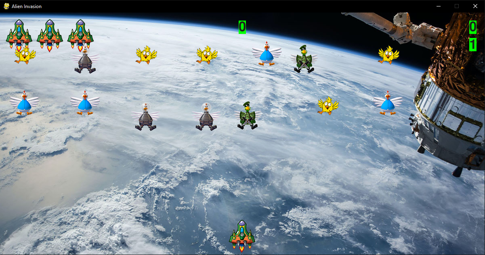

The player controls a ship that appears at
the bottom center of the screen. The player can move the ship
right and left using the arrow keys and shoot bullets using the
spacebar. When the game begins, a fleet of aliens fills the sky
and moves across and down the screen. The player shoots and
destroys the aliens. If the player shoots all the aliens, a new fleet
appears that moves faster than the previous fleet. If any alien hits
the player’s ship or reaches the bottom of the screen, the player
loses a ship. If the player loses three ships, the game ends.

# game.py
The main file, game.py, creates a number of important objects used
throughout the game: the settings are stored in ai_settings, the main display
surface is stored in screen, a ship instance is created in this file as
well, the game stats that are stored in stats, scoreboard stored in sb. Also stored in game.py is the main loop of the game, which is
a while loop that calls check_events(), ship.update(), and update_screen().
game.py is the only file you need to run when you want to play
Alien Invasion. The other files settings.py, game_functions.py, ship.py, alien.py, bullet.py, button.py, game_stats.py, scoreboard.py —
contain code that is imported, directly or indirectly, into this file.
settings.py

# The settings.py file contains the Settings class. 
This class has an __init__() method, which initializes attributes controlling the game’s
appearance and the ship’s speed, an initialize_dynamic_settings method that contains settings that change throught the game and an increase_speed method that increase speed settings and alien point values.

# The game_functions.py
file contains a number of functions that carry out
the bulk of the work in the game. The check_events() function detects relevant
events, such as keypresses and releases, and processes each of these
types of events through the helper functions check_keydown_events() and
A Ship That Fires Bullets
check_keyup_events(). For now, these functions manage the movement of
the ship. The game_functions module also contains update_screen(), which
redraws the screen on each pass through the main loop.

# The ship.py
file contains the Ship class. Ship has an __init__() method, an
update() method to manage the ship’s position, and a blitme() method
to draw the ship to the screen. The actual image of the ship is stored in
ship.bmp, which is in the images folder.

# The alien.py
file contains the Alien class. Alien has an __init__() method, a blitme() method
to draw the ship to the screen, check_edges() method to check if the alien is at edge of screen and an update() method that updates the postion of the alien.

# The bullet.py
file contains the Bullet class. Bullet has an __init__() method, an update() method that updates the postion of the alien and a draw_bullet() method that draw the bullet on the screen.

# The button.py 
file contains the Button class. Button has an __init__() method, an prep_msg() method that turn messages into a rendered image and center text on the button and a draw_button() method that draw the blank button and then add a message on him

# The game_stats.py 
file contains the GameStats class. GameStats has an __init__() method and an reset_stats() method.

# The scoreboard.py
file contains the ScoreBoard class. ScoreBoard has an __init__() method, a prep_score method that turn the score into a rendered image and display the score at the top right of the screen, a prep_high_score() that turn the high score into a rendered image and center the high score at the top of the screen, a prep_level() method that turn the level into a rendered image and position the level below the score, a prep_ship() method that show how many ships are left and a show_score() method that draw score and ships to the screen.

